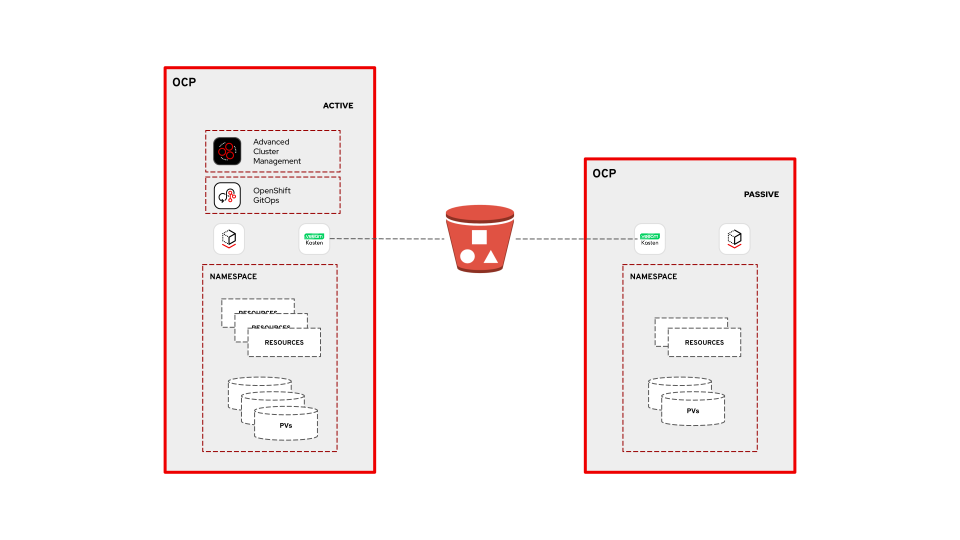

# ⚠️ Disclaimer ⚠️
This repository automates the creation of a **demo environment** and is **not intended for production use**.
However, best practices have been followed where possible, such as using Sealed Secrets to encrypt sensitive data, to encourage good habits even in non-critical environments. 

# Requirements

## Tools

The following CLI tools must be installed and available in your `PATH`:

- **oc**: OpenShift CLI, used to interact with the clusters.
- **kubeseal**: Used to encrypt Kubernetes secrets for GitOps delivery.
- **yq**: Used for processing and transforming YAML files.
- **git**: Required to manage and push SealedSecret resources to a forked Git repository.

> ❗ All tools must be installed prior to executing the automation scripts. No installation checks are performed automatically.

> ✅ The script will generate the necessary encryption keys and SealedSecrets, and push them to your forked Git repository. Ensure that `git` is authenticated and configured to allow `push` operations to your fork.

## Cluster Architecture

- Two OpenShift Container Platform (OCP) clusters are required. These will be referenced as **active** (or hub) and **passive** (or managed).
- Both clusters must have **OpenShift Virtualization (OCP Virt)** installed and properly configured.
- **OpenShift GitOps must NOT be pre-installed**. The automation will handle its installation as part of the deployment.
  - The script does not verify if OpenShift GitOps is already present — if it is, the automation may fail or produce inconsistent results.

# Purpose
This repository automates the setup of a demo environment showcasing data protection using **Veeam Kasten**. It involves two generic OpenShift Container Platform (OCP) clusters, referred to as **active** and **passive**. An S3 bucket is used for exporting snapshots, enabling backup and restore workflows.

On the active OCP cluster, both **Advanced Cluster Management** (ACM) and **OpenShift GitOps** operators are installed to provide centralized management and GitOps-based control over both clusters. This deployment choice is for **demonstration purposes only**; in a **real-world production scenario**, these operators would typically be **installed in a dedicated management cluster**.

# Architecture



# Usage

1. Create a fork of the repository to your own GitHub account. Clone it and move to the project root directory.
2. Replace any references in the project to point to your fork instead of the original repository.
```bash
sed -i 's|https://github.com/too-common-name/veeam-demo.git|https://github.com/YOUR_USERNAME/veeam-demo.git|g' argocd-apps/*.yaml
```
3. Add your `access_key` and `secret_key` in `aws-automations/vars/sensitive_stub.yml` file.
```
access_key: AKIA.....
secret_key: USSA.....
```

4. Seal it.
```bash
ansible-vault encrypt --output aws-automations/vars/sensitive.yml aws-automations/vars/sensitive_stub.yml --ask-vault-pass
```

5. Change bucket name in `aws-automations/vars/main.yml`. 

6. Run the playbook using `ansible-playbook aws-automations/playbook.yml --ask-vault-pass`.
  - If you get a priviledge error your bucket name may already exist, change it and re-run the playbook.
  - On success, a file named `aws-automations/kasten-backup-user_aws_credentials.yaml` will be created. This file contains the `access_key` and `secret_key` for an IAM user with minimal privileges, limited to the new S3 bucket.

7. Run demo script `./demo.sh <HUB_OPENSHIFT_API_URL> <HUB_USERNAME> <HUB_PASSWORD> <MANAGED_OPENSHIFT_API_URL> <MANAGED_USERNAME> <MANAGED_PASSWORD>`. The script takes approximately 10 minutes to complete. If timeouts occur, you can safely re-run it.
All command output is logged in the `./deployment.log` file, which can help with troubleshooting in case of failure.

8. Create restore policy on managed cluster. 
   - Get the `receiveString` from the Kasten backup policy
```bash
oc login --username=<HUB_USERNAME> --password=<HUB_PASSWORD> --server=<HUB_OPENSHIFT_API_URL>
yq -i ".spec.actions[0].importParameters.receiveString = \"$(oc get policies.config.kio.kasten.io 
backup-vm -n kasten-io -o jsonpath='{.spec.actions[1].exportParameters.receiveString}')\"" ./restore/restore.yaml 
```

# Demo script steps

1. **Log in to the Hub cluster.**

2. **Add the `admin` user to the `cluster-admins` group.**

3. **Install and configure ArgoCD on the Hub:**
   - Apply the manifests to install the OpenShift GitOps Operator (ArgoCD).
   - Wait for all pods in the `openshift-gitops-operator` namespace to be in `Running` state.
   - Apply a customization patch to the ArgoCD instance.
   - Create an ArgoCD `Application` to install ACM on the Hub cluster.

4. **Register the managed cluster in ACM:**
   - Wait for the `passive-cluster` namespace to be created.
   - Log in to the managed cluster to obtain an authentication token.
   - Return to the Hub cluster and create an `auto-import` secret for ACM.

5. **Manage keys for Sealed Secrets:**
   - If not already present, generate a TLS key pair (private and public keys).
   - On both the Hub and managed clusters:
     - Create the `sealed-secrets` namespace.
     - Delete and recreate the TLS secret for the Sealed Secrets controller.
     - Label the secret as the active key.
     - Restart the Sealed Secrets controller pod (if already running).

6. **Deploy Sealed Secrets via GitOps:**
   - Apply the global ArgoCD `Application` for Sealed Secrets.

7. **Generate and manage Sealed Secrets:**
   - Read the AWS credentials from `aws-automations/kasten-backup-user_aws_credentials.yaml`.
   - Substitute values into a stub file and seal them using `kubeseal`:
     - `s3-kasten` sealed secret.
     - `vm-cred` sealed secret for cloud-init.
   - Commit and push the sealed secrets to the Git repository.

8. **Annotate for Kasten support:**
   - For both Hub and managed clusters:
     - Retrieve the default `StorageClass` and `VolumeSnapshotClass`.
     - Annotate them to support integration with Kasten K10.

9. **Update Kasten CRDs with S3 bucket information:**
   - Read the bucket name and region from the Ansible file (`vars/main.yml`).
   - If values have changed, update `global-values.yaml` and commit/push to Git.

10. **Final GitOps deployment:**
    - Apply `global_operators.yaml` to deploy Kasten across clusters.
    - Apply vm_application.yaml to create a Fedora VM via GitOps on the Hub cluster. A backup policy for Kasten will also be created, which must be triggered manually to back up the VM and export the backup to your S3 bucket.